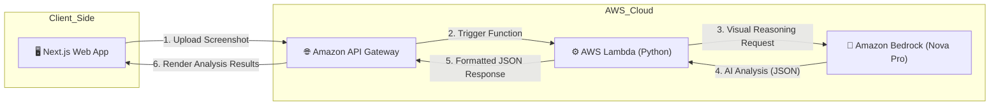

# Clarity AI: Enterprise Accessibility Audit Powered by Amazon Nova Pro

[](https://devpost.com)
[](https://opensource.org/licenses/MIT)

**Clarity AI** is an advanced web accessibility auditing platform designed to bridge the digital divide. By leveraging the multimodal visual reasoning of **Amazon Nova Pro**, Clarity AI transforms static UI screenshots into actionable insights, empowering developers to build inclusive digital experiences with ease.

## 🌟 Key Features
- **Multimodal Visual Audit:** Uses Amazon Nova Pro to "perceive" UI elements just like a human auditor.
- **POUR Principle Categorization:** Issues are classified under WCAG's Perceivable, Operable, Understandable, and Robust principles.
- **Actionable Remediation:** Provides clear, conceptual advice and severity levels (High/Medium/Low) for each detected barrier.
- **Enterprise Reporting:** Instant "Clarity Score" and the ability to export professional PDF reports for team collaboration.
- **100% Serverless:** Built for scale and efficiency using AWS native services.

## 🏗️ Architecture
The system follows a modern serverless architecture to ensure high availability and cost-efficiency.



## 🛠️ Tech Stack
* AI Engine: Amazon Bedrock (Amazon Nova Pro)
* Backend: AWS Lambda (Python 3.12)
* API Management: Amazon API Gateway
* Frontend: Next.js 14, React, Tailwind CSS, Lucide Icons

## 🚀 Getting Started

### Prerequisites
* AWS Account with Amazon Nova Pro model access enabled in Amazon Bedrock.
* Node.js 18+ and Python 3.9+ installed locally for development.

### Backend Setup
1. Navigate to the `clarity-backend` directory.
2. Deploy the `handler.py` to AWS Lambda.
3. Critical Configuration: Set the Lambda Timeout to 1 minute to allow enough time for Nova Pro's deep visual reasoning.
4. Configure API Gateway with a POST method and enable CORS.

### Frontend Setup
1. Navigate to the clarity-frontend directory.
2. Install dependencies:
    ```
    npm install
    ```
3. Configure your environment variables in .env.local:
    ```
    NEXT_PUBLIC_API_URL=[https://your-api-gateway-url.amazonaws.com/dev/audit/image](https://your-api-gateway-url.amazonaws.com/dev)
    ```
4. Start the development server:
    ```
    npm run dev
    ```

## 📈 Impact
Clarity AI reduces the complexity of manual accessibility auditing, allowing startups and independent developers to ensure their products are inclusive from day one without needing expensive consultancy.

## 👨‍💻 Developer
Tarq Hilmar Siregar
* [YouTube-Demo](https://youtu.be/d9B5JUmLB5I)
* [LinkedIn](https://www.linkedin.com/in/tarqhilmarsiregar/)